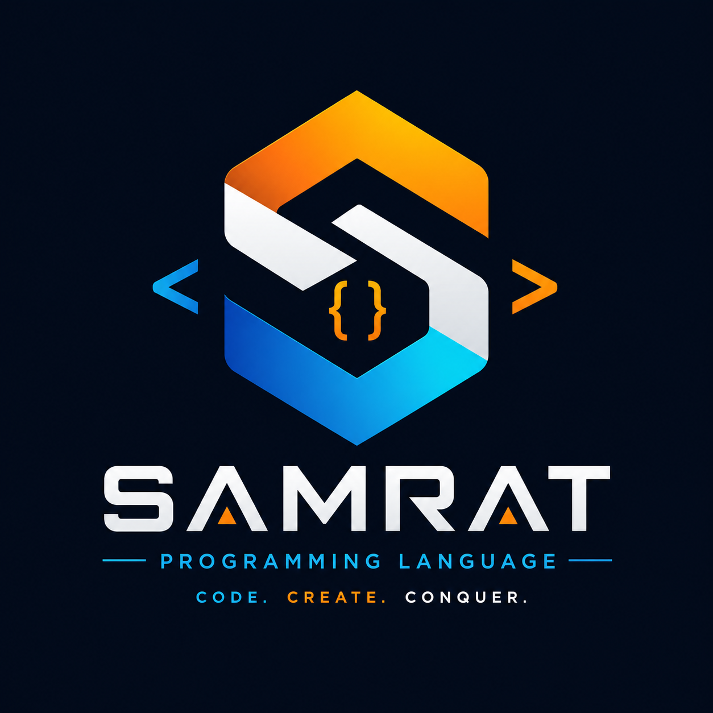

# Samrat Programming Language Toolchain V1.1.5 (2.0.0 Architecture)



**Samrat** is a high-performance, English-first, native conversational programming language written fully from scratch in Rust. It compiles deterministic, human-readable English syntax directly into optimized machine code using Cranelift and LLVM-equivalent native backends.

## Key Features

- **English-First Conversational Syntax**: Write code that reads like natural English instructions without sacrificing strict determinism or type safety.
  - Example: `When the program starts, create numbers from 1 to 100, keep the even numbers, add them together, and show the total.`
- **Complete Native Stack**: Built entirely from first principles in Rust (`samrat-lexer`, `samrat-parser`, `samrat-semantic`, `samrat-ir`, `samrat-codegen`, `samrat-runtime`, `samrat-stdlib`, `samrat-pkg`, `samrat-debug`).
- **Target Architectures**: Native machine code emission for x86-64 and ARM64.
- **Unified Toolchain CLI (`samrat`)**:
  - `samrat build <file>` - Compiles English code into native object/binary targets.
  - `samrat run <file>` - Fast execution via native AST/IR engine.
  - `samrat check <file>` - Strict syntax and type checking.
  - `samrat fmt <file>` - Standardizes English code layout.
  - `samrat test <path>` - Runs native test suite runner.
  - `samrat pkg init/add` - Package manager for `Samrat.toml`.
  - `samrat debug <file>` - Emits debug sourcemaps and debug metadata.
  - `samrat doc <path>` - Auto-generates documentation from AST annotations.

## Getting Started

### Prerequisites

- Rust 1.70+ (`cargo`)
- `cc`, `gcc`, or `clang` for native binary linking (optional, outputs `.o` object files otherwise)

### Building from Source

```bash
cargo build --release --workspace
```

### Quick Example

Create a file named `hello.samrat`:

```
When the program starts, create numbers from 1 to 100, keep the even numbers, add them together, and show the total.
```

Run directly:

```bash
cargo run --bin samrat -- run hello.samrat
# Output: Total: 2550
```

Build to native machine code:

```bash
cargo run --bin samrat -- build hello.samrat -o hello
./hello
```

## Documentation

For full language design, architecture, and references, see:

- [Language Specification](LANGUAGE_SPEC.md)
- [Architecture Details](docs/ARCHITECTURE.md)
- [Language Reference](docs/LANGUAGE_REFERENCE.md)
- [Standard Library Reference](docs/STDLIB_REFERENCE.md)
- [Changelog](CHANGELOG.md)
- [Roadmap](ROADMAP.md)

## License

This project is licensed under the MIT License - see the [LICENSE](LICENSE) file for details.
